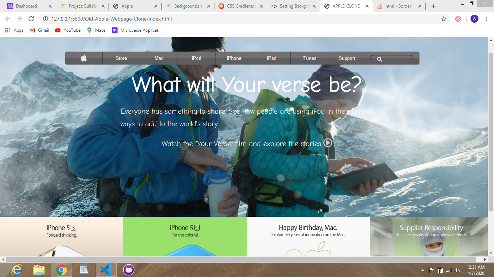

# Old Apple Webpage Clone

> This project aims at cloning Apples's old webpage. It is meant to help me practice working with backgrounds and gradients in css.

## Built With

- HTML,
- CSS

## Authors

👤 **Samuel Ebeagu**

- Github: [@ebeagusamuel](https://github.com/ebeagusamuel)
- Twitter: [@ebeagu_samuell](https://twitter.com/ebeagu_samuel)
- Linkedin: [Ebeagu Samuel](https://www.linkedin.com/in/samuel-ebeagu-7b4617110)

## 🤝 Contributing

Contributions, issues and feature requests are welcome!

Feel free to check the [issues page](issues/).

## 📝 License

This project is [MIT](lic.url) licensed.
